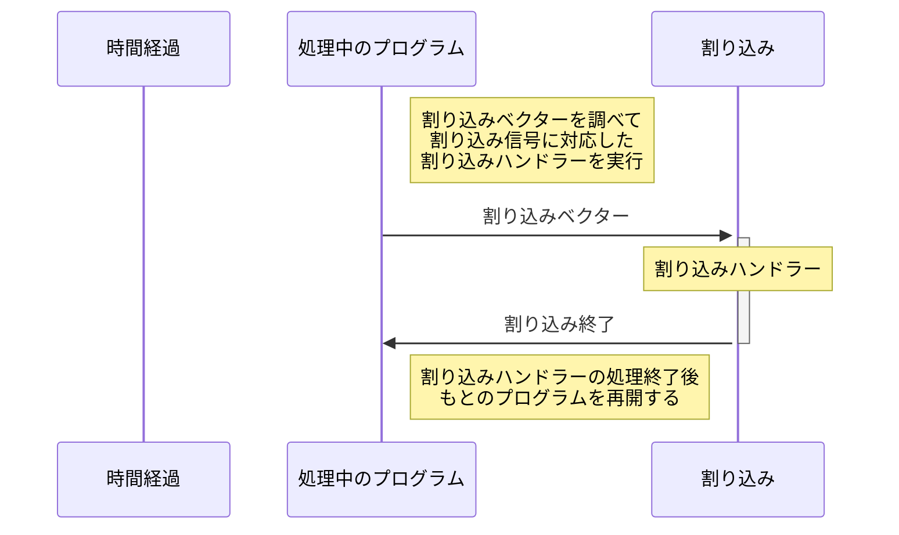

# イベント駆動型
## イベント駆動とは
Linuxに限らず、多くのOSのカーネルはほとんどの場合、自発的に動作することはない。ハードウェアやコマンド、アプリケーションなどから指示があった場合にだけ処理を実行する。
このように何らかのイベントを動作のトリガーにしているプログラムを**イベント駆動型プログラム**という。
カーネルの処理のトリガーになりうるイベントには主に3種類ある。周辺機器からCPUに送られる信号による**ハードウェア割り込み**、ソフトウェアの動作によってCPU内で発生する**ソフトウェア割り込み/例外**、そしてアプリケーションが発行する**システムコール**の3種類である。

## 割り込みとは
**割り込み**とは現在の作業を中断して、別の作業をすることすることである。ほとんどのCPUは割り込みをサポートしている。

