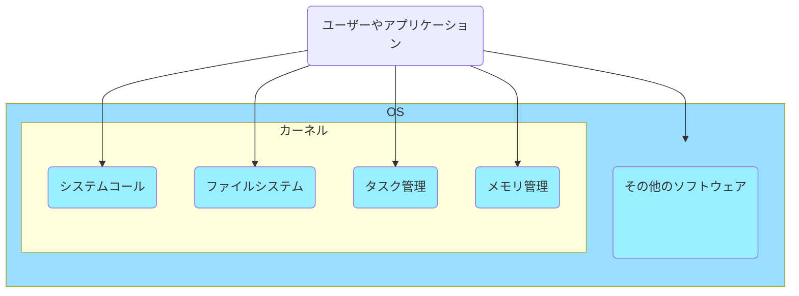

# Linuxカーネルの基礎
## Linuxカーネルとは何か

OSはコンピュータのハードウェアとソフトウェアを管理するソフトウェアの集合である。
OSのうち中核を担うのがカーネルである。カーネルは植物内部にある「仁」のことで種子の内部の核に見立てている。
カーネルが担当する領域はOSによって異なるが、メモリ管理やプログラムの実行制御は多くのOSでカーネルが担う設計になっている。
Linuxはデバイスドライバやネットワークなどもカーネルの担当領域であり、カーネルの領域が広いOSである。このよう担当領域が広いカーネルを**モノシリックカーネル**という。逆にカーネルの担当領域を小さくしたものにGNU HurdやMINIXといったOSがあるが、これらのようなカーネルを**マイクロカーネル**という。

